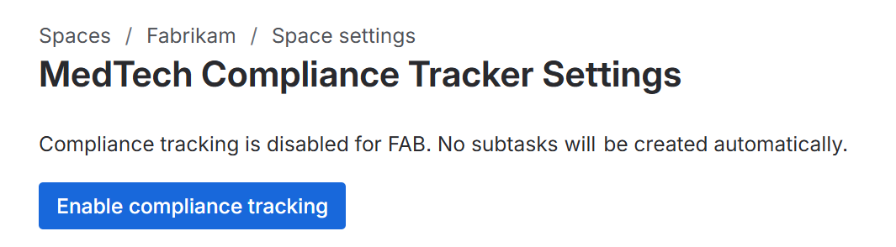

# MedTech Compliance Tracker — Documentation

## Overview

MedTech Compliance Tracker is a Jira app for medical device software teams. When a new Jira issue is created, the app automatically detects regulatory obligations and creates compliance sub-tasks — each with step-by-step instructions mapped to the exact clause of the relevant standard.

No configuration is required other than enabling the app on a per-project basis. Install the app, enable it on relevant projects and it works immediately.

---

## Requirements

- Jira Cloud (classic or team-managed projects)
- An active MedTech Compliance Tracker license

---

## Installation

1. Go to the [Atlassian Marketplace listing](#) and click **Get it now**.
2. Select your Jira Cloud site and follow the installation prompts.
3. Enable the app by navigating to `Space Settings -> Apps -> MedTech Compliance Tracker Settings`. The URL for this page is of the form `https://your-account.atlassian.net/jira/software/c/projects/project-key/settings/apps/{appId}/{envId}` [[1](https://developer.atlassian.com/platform/forge/manifest-reference/modules/jira-project-settings-page/)].

---

## How it works

Every time a new Jira issue is created, the app:

1. Reads the issue **summary** and **description**.
2. Scans both fields for keywords associated with regulatory obligations.
3. Creates one sub-task for each matched compliance rule.

Each sub-task includes:
- A clear title identifying the standard and clause (e.g. `✅ Compliance: Update Software Requirements Specification (IEC 62304 §5.2)`)
- Step-by-step instructions for satisfying the obligation
- The applicable safety class (A, B, or C) and required evidence for the Design History File (DHF)

Sub-tasks are created as children of the original issue and appear immediately in the issue's sub-task list.

---

## Covered standards and rules

| Standard | Scope |
|---|---|
| IEC 62304 §5.2 | Software Requirements Analysis |
| IEC 62304 §5.3 | Software Architectural Design |
| IEC 62304 §5.4 | Software Detailed Design |
| IEC 62304 §5.5 | Software Unit Implementation and Verification |
| IEC 62304 §5.6 | Software Integration and Integration Testing |
| IEC 62304 §5.7 | Software System Testing |
| IEC 62304 §5.8 | Software Release |
| IEC 62304 §6 | Software Maintenance Process |
| IEC 62304 §7 / ISO 14971 | Software Risk Management |
| IEC 62304 §8 | Software Configuration Management |
| IEC 62304 §9 | Software Problem Resolution |
| IEC 62366-1 | Usability Engineering |
| ISO 14971 | Risk Management File |
| IEC 81001-5-1 / AAMI TIR57 | Cybersecurity |
| HIPAA / GDPR | Data Privacy |
| 21 CFR Part 820 / MDR 2017/745 | Regulatory Submission Impact |
| ISO 13485 §7.3.9 | Design Change Control |
| IEC 62304 §5.3.3 / §8.1.2 | SOUP Evaluation and Registration |

---

## How rules are triggered

The app scans the issue summary and description and may create multiple sub-tasks if the issue touches several regulatory areas. It is intentionally designed to err on the side of over-flagging rather than miss an obligation.

If a sub-task is not relevant to your ticket, simply delete it.

---

## Behavior notes

- **Sub-tasks are ignored.** The app does not process sub-tasks, only parent issues, to prevent recursive triggering.
- **Multiple rules can fire** on a single issue. A ticket about a UI bug fix may trigger rules for IEC 62304 §9 (Problem Resolution), IEC 62366-1 (Usability Engineering), and IEC 62304 §5.5 (Unit Verification) simultaneously.
- **Classic projects:** Sub-tasks are created using the project's dedicated sub-task issue type.
- **Team-managed projects:** Sub-tasks are created as child Tasks, since team-managed projects do not have a dedicated sub-task type.

---

## Frequently asked questions

**Does the app store any of my Jira data?**
No. Issue content is processed in-memory within the Atlassian Forge runtime and is never written to any external system. See the [Privacy Policy](privacy-policy.md) for details.

**Can I customise the rules or keywords?**
Not in this version. The bundled ruleset covers the full IEC 62304 lifecycle and related standards applicable to most medical device software teams. Custom rules are planned for a future release.

**What happens if the app creates a sub-task I don't need?**
Delete it. The app only runs on issue creation, so no new sub-tasks will be created for that issue unless it is re-created.

**Does the app work on existing issues?**
Yes. Run the backfill tool to create compliance sub-tasks for existing issues. The backfill tool can be found under the app settings page - the same
page that you use to enable or disable the app.

---

## Support

For questions or issues, contact: support@essofore.com
